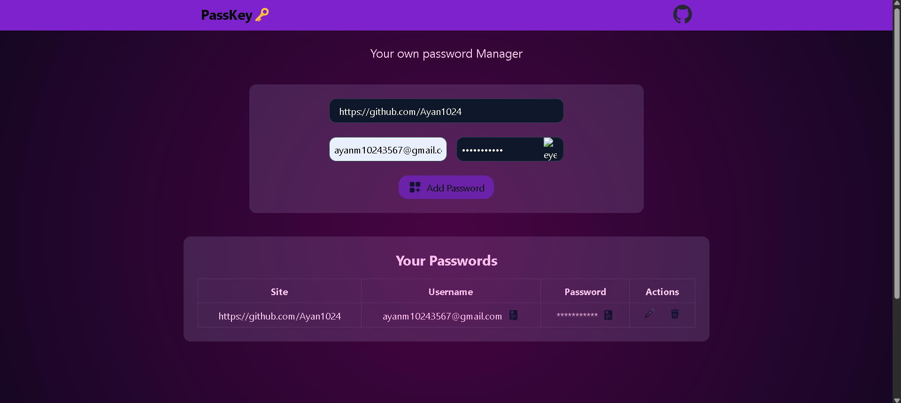

# 🔐 Passkey – Your Own Password Manager

Passkey is a modern, secure, and responsive password manager built with the **MERN stack**. It allows users to store, view, and delete passwords safely using a MongoDB backend, Express server, and React frontend.

---

## 📦 Tech Stack

- **Frontend:** React, Tailwind CSS  
- **Backend:** Node.js, Express.js  
- **Database:** MongoDB  
- **Others:** dotenv, cors, body-parser , React-Toast 

---

## 🚀 Features

- 🔐 Save passwords securely  
- 📜 View all saved passwords  
- 🗑️ Delete unwanted credentials  
- 🌐 API-based architecture  
- 🎨 Clean and responsive UI  

---

## 📁 Project Structure

# PassKey-your_own_password_Manager
 It's a password manager , which store your sitename , username , and passwords in local storage and in mongodb . Based on React, Express & MongoDB
